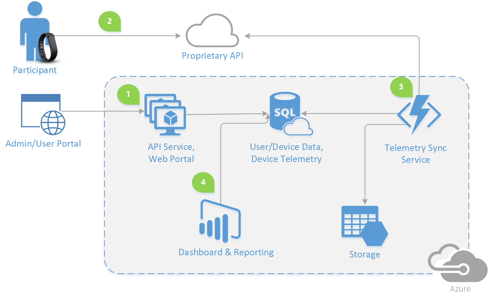

# Welcome to Labrat!

Labrat is an open source Clinical Study platform that enables the management of health-related interventions that are targeted to evaluate health effects and outcomes for a specific control group of participants. The platform facilitates resource scheduling, participant and equipment management, as well as device data and telemetry management.

The Labrat platform provides: 
 
1. Device and participent management, as well as help to facilitate the device lending process
1. Collect and store the study participant's telemetry from a set of manged wearble devices
1. Facilitate the scheduling and the telemetry sync with the 3rd party APIs 
1. Visualize the Clinical Study result data through a set of dashboard and reporting capabilities

&nbsp;

 
&nbsp;

Prerequisites
----
In order to successfully complete this lab you will need:
- An active Microsoft Azure Subscription. If you do not have a current subscription, you can create one using the **<a target="_blank" href="https://azure.microsoft.com/en-us/free/">free trial</a>**
- Labrat uses a number of open source projects to work properly, please refer to the individual service for a list of requeried software/version.

License
----

MIT

[Gatling]: http://gatling.io/
[Node.js]: https://nodejs.org/
[Yarn]: https://yarnpkg.org/
[Bower]: http://bower.io/
[Gulp]: http://gulpjs.com/
[BrowserSync]: http://www.browsersync.io/
[Karma]: http://karma-runner.github.io/
[Jasmine]: http://jasmine.github.io/2.0/introduction.html
[Protractor]: https://angular.github.io/protractor/
   [Java]: <http://java.com> 
   [SpringBoot]: <https://projects.spring.io/spring-boot/>
   [Maven]: <https://maven.apache.org>
   [Hibernate]: <http://hibernate.org/>
   [Liquibase]: <http://www.liquibase.org/>
   [Ehcache]: <http://www.ehcache.org/>
   [Swagger]: <http://swagger.io/>
   [Gatling]: <http://gatling.io/>
   [Protractor]: <http://www.protractortest.org/>
   [labrat]: <https://github.com/microsoft/labrat>
   [git-repo-url]: <https://github.com/joemccann/dillinger.git>
   [john gruber]: <http://daringfireball.net>
   [df1]: <http://daringfireball.net/projects/markdown/>
   [markdown-it]: <https://github.com/markdown-it/markdown-it>
   [Ace Editor]: <http://ace.ajax.org>
   [node.js]: <http://nodejs.org>
   [Twitter Bootstrap]: <http://twitter.github.com/bootstrap/>
   [jQuery]: <http://jquery.com>
   [@tjholowaychuk]: <http://twitter.com/tjholowaychuk>
   [express]: <http://expressjs.com>
   [AngularJS]: <http://angularjs.org>
   [Gulp]: <http://gulpjs.com>
   [Bower]: <https://bower.io>
